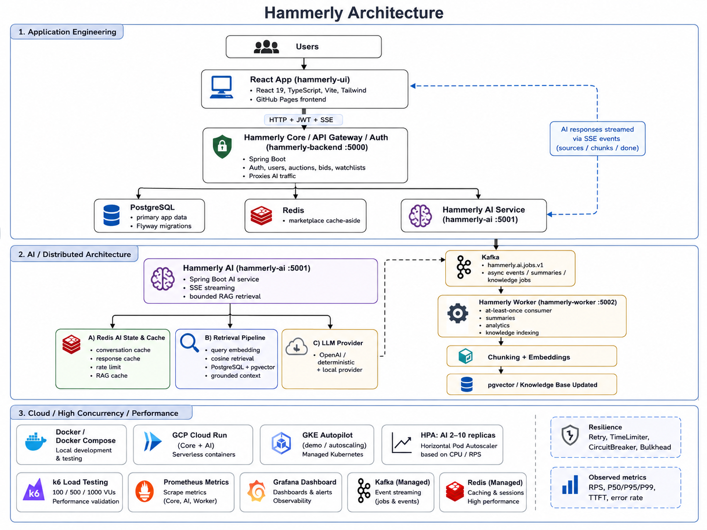

<p align="center">
  
</p>

# Hammerly — Auction Platform with AI Support

Hammerly is a full-stack auction platform built with React and Spring Boot, featuring real-time bidding, authentication, AI-powered customer support, distributed background processing, caching, cloud deployment, and production-style observability.

🌐 **Live Demo:** [hammerly.jqiwen.com](https://hammerly.jqiwen.com)

---

## Overview

Hammerly combines a traditional marketplace application with an independent AI support system and distributed backend architecture.

Users can browse auctions, place bids, manage watchlists, and interact with an AI support assistant that uses RAG to retrieve relevant knowledge and streams responses back to the browser through Server-Sent Events (SSE).

The system is designed around scalability, resilience, and observability using Redis, Kafka, Docker, Kubernetes, GCP, Prometheus, Grafana, and k6.

---

## Architecture



The user-facing request path stays synchronous through the React frontend, Spring Boot Core service, and AI service, while Kafka-backed workers handle asynchronous summaries, analytics, and knowledge indexing outside the main request path.

---

## Key Features

- Full-stack auction marketplace with authentication, profiles, bidding, and watchlists
- AI customer support with RAG, pgvector retrieval, citations, and SSE streaming
- Redis caching for marketplace data, conversations, AI responses, and rate limiting
- Kafka-based asynchronous processing for summaries, analytics, and knowledge indexing
- Transactional outbox and at-least-once worker processing for durable background jobs
- Resilient AI provider integration with retry, timeout, circuit breaker, and bulkhead protection
- Dockerized multi-service local environment
- Kubernetes deployment with Horizontal Pod Autoscaling
- GCP deployment with Cloud Run, GKE, Artifact Registry, Secret Manager, and Workload Identity Federation
- Prometheus metrics, Grafana dashboards, and runtime alert rules
- k6 load testing and CI performance regression checks
- GitHub Actions CI/CD for automated validation and deployment

---

## Tech Stack

| Area | Technologies |
|---|---|
| **Frontend** | React 19, TypeScript, Vite, Tailwind CSS |
| **Backend** | Java 21, Spring Boot, Spring Security |
| **Database** | PostgreSQL, Supabase, Flyway, pgvector |
| **AI** | OpenAI, Spring AI, RAG, Embeddings, SSE |
| **Caching** | Redis, Upstash Redis |
| **Messaging** | Apache Kafka |
| **Resilience** | Resilience4j, Retry, Circuit Breaker, Bulkhead, TimeLimiter |
| **Containers** | Docker, Docker Compose |
| **Cloud** | GCP Cloud Run, GKE Autopilot, Artifact Registry, Secret Manager |
| **Observability** | Prometheus, Grafana |
| **Performance** | k6 |
| **CI/CD** | GitHub Actions, GitHub OIDC / Workload Identity Federation |

---

## System Design

### Application Engineering

```text
Users
  ↓
React + TypeScript
  ↓ HTTP / JWT / SSE
Spring Boot Core
  ├── Authentication
  ├── Auctions & Bidding
  ├── PostgreSQL
  ├── Redis Cache
  └── AI Proxy
```

### AI & Distributed Processing

```text
Hammerly AI
  ├── Redis AI State & Cache
  ├── RAG Retrieval
  │     └── PostgreSQL + pgvector
  ├── LLM Provider
  └── Kafka
        ↓
   Hammerly Worker
        ├── Summaries
        ├── Analytics
        └── Knowledge Indexing
```

AI responses are streamed back to the frontend using SSE, while Kafka keeps background work outside the synchronous chat response path.

---

## High Concurrency & Performance

Hammerly was load-tested with a deterministic AI provider so application and infrastructure performance could be measured without generating paid OpenAI traffic.

### GKE Autoscaling Benchmark

| Metric | Result |
|---|---:|
| Maximum concurrency | **1,000 VUs** |
| Successful streams at 1,000 VUs | **9,510** |
| Throughput | **79.25 streams/sec** |
| Error rate | **0.0105%** |
| P50 latency | **2.55 s** |
| P95 latency | **3.32 s** |
| P99 latency | **3.66 s** |
| First-token P95 | **1.02 s** |

Kubernetes HPA automatically scaled the AI service from:

```text
2 → 5 → 7 → 10 pods
```

and returned to the minimum replica count after the load test.

A separate local benchmark also completed the full **100 / 500 / 1,000 VU** workload with **13,547 successful SSE streams and zero failures**.

Detailed results are available under:

```text
docs/performance/
load-test/
```

> These benchmarks validate Hammerly's application and infrastructure behavior with a deterministic provider and should not be interpreted as OpenAI provider capacity guarantees.

---

## Reliability

The AI request path uses **Resilience4j** to protect external provider calls:

```text
Request
   ↓
TimeLimiter
   ↓
Retry
   ↓
Circuit Breaker
   ↓
Bulkhead
   ↓
LLM Provider
```

The system includes:

- bounded retries with backoff
- 429 and retryable 5xx handling
- first-token and streaming timeouts
- circuit breaker protection
- concurrency bulkheads
- safe SSE error responses
- Redis graceful degradation
- asynchronous Kafka processing outside the critical response path

---

## Observability

Hammerly Core, AI, and Worker expose Prometheus metrics for:

- request throughput
- P50 / P95 / P99 latency
- AI first-token latency
- provider errors and retries
- Redis cache performance
- RAG retrieval latency
- Kafka processing
- worker failures and dead-letter events
- circuit breaker state
- JVM health

Prometheus collects the metrics and Grafana provides centralized dashboards.

Runtime alert rules detect conditions such as:

- service outages
- high AI error rate
- high AI latency
- high first-token latency
- Redis degradation
- circuit breaker failures
- Kafka publish failures
- worker failures
- dead-letter events

---

## Deployment

### Production

```text
GitHub Pages
     │
     ▼
React Frontend
     │
     ▼
GCP Cloud Run
Hammerly Core
     │
     ▼
GCP Cloud Run
Hammerly AI
  ├── OpenAI
  ├── Upstash Redis
  └── Supabase PostgreSQL + pgvector
```

Asynchronous processing is separated from the request path:

```text
Core / AI
    │
    ▼
Kafka
Compute Engine
    │
    ▼
Hammerly Worker
Cloud Run Worker Pool
```

Production secrets are stored in **Google Secret Manager**, and GitHub Actions authenticates to GCP using **OIDC / Workload Identity Federation** instead of long-lived service-account keys.

### Kubernetes

Hammerly also includes a separate GKE Autopilot deployment for Kubernetes and autoscaling validation:

```text
GKE
├── Backend ×2
├── AI ×2–10
│    └── Horizontal Pod Autoscaler
├── Worker
├── Redis
├── Kafka
├── Prometheus
└── Grafana
```

The benchmark GKE cluster was deleted after testing to avoid unnecessary cloud cost; the Kubernetes manifests and benchmark evidence remain in the repository.

---

## CI/CD

GitHub Actions validates affected services before deployment.

```text
Push / Pull Request
        │
        ▼
        CI
   ┌────┼────┐
   │    │    │
 Core   AI   UI
   │    │    │
   ▼    ▼    ▼
 Tests / Build
        │
        ▼
Deployment
```

Production deployments:

```text
Frontend → GitHub Pages
Core     → GCP Cloud Run
AI       → GCP Cloud Run
Worker   → Artifact Registry / Worker Pool
```

CI also includes a lightweight **k6 performance smoke test** to detect obvious performance regressions without running the full 1,000-VU benchmark on every change.

---

## Local Development

### Requirements

- Docker Desktop
- Docker Compose

Start the complete local environment:

```bash
docker compose up -d --build
```

This starts:

```text
Hammerly Backend
Hammerly AI
Hammerly Worker
PostgreSQL
Redis
Kafka
Prometheus
Grafana
```

Check service status:

```bash
docker compose ps
```

### Local Services

| Service | Address |
|---|---|
| Backend | http://localhost:5000 |
| AI Service | http://localhost:5001 |
| Worker Metrics | http://localhost:5002 |
| Prometheus | http://localhost:9090 |
| Grafana | http://localhost:3001 |

Health checks:

```bash
curl http://localhost:5000/actuator/health
curl http://localhost:5001/actuator/health
curl http://localhost:5002/actuator/health
```

Expected response:

```json
{"status":"UP"}
```

Stop the environment:

```bash
docker compose down
```

---

## Repository Structure

```text
Hammerly/
│
├── hammerly-ui/          React + TypeScript frontend
├── hammerly-backend/     Core Spring Boot API
├── hammerly-ai/          AI, RAG, SSE, and Redis service
├── hammerly-worker/      Kafka background worker
│
├── k8s/                  Kubernetes / GKE manifests
├── load-test/            k6 performance tests and results
├── observability/        Prometheus and Grafana
├── scripts/              Local and GCP management scripts
├── docs/                 Architecture, deployment, and performance docs
│
├── docker-compose.yml
└── README.md
```

---

## Project Highlights

```text
Full Stack
React + Spring Boot + PostgreSQL + Authentication + Redis

AI / Distributed Systems
RAG + LLM + pgvector + Kafka + Async Processing

Cloud / Performance
Docker + Kubernetes + GCP + k6 + Prometheus + Grafana
```

---

## Documentation

More detailed technical documentation is kept under `docs/`, including:

- system architecture
- Kafka event contracts
- GCP deployment
- Kubernetes / GKE deployment
- observability
- performance benchmarks
- load-test evidence

